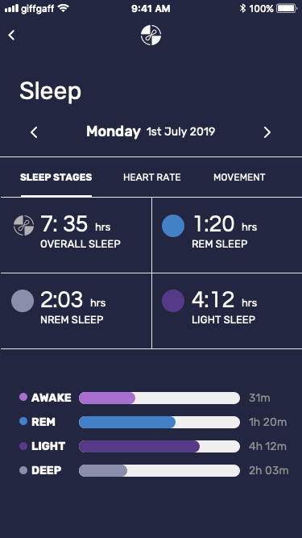

# Composing Screens In React Native

## Workshop at connecTech conference at Lloyds Bank

### Start the project

1. `git clone`
2. cd into the folder
3. run `yarn`
4. start metro with `react-native start --reset-cache`
5. run on simulator with:
   #### iOS:
   `cd ios && pod install` and  
   `react-native run-ios`
   #### Android:
   `react-native run-android`

### UI screens

You can find them in `assets` folder.

#### Login screen

#### Sleep details screen

#### Heart details screen

#### Movement details screen

